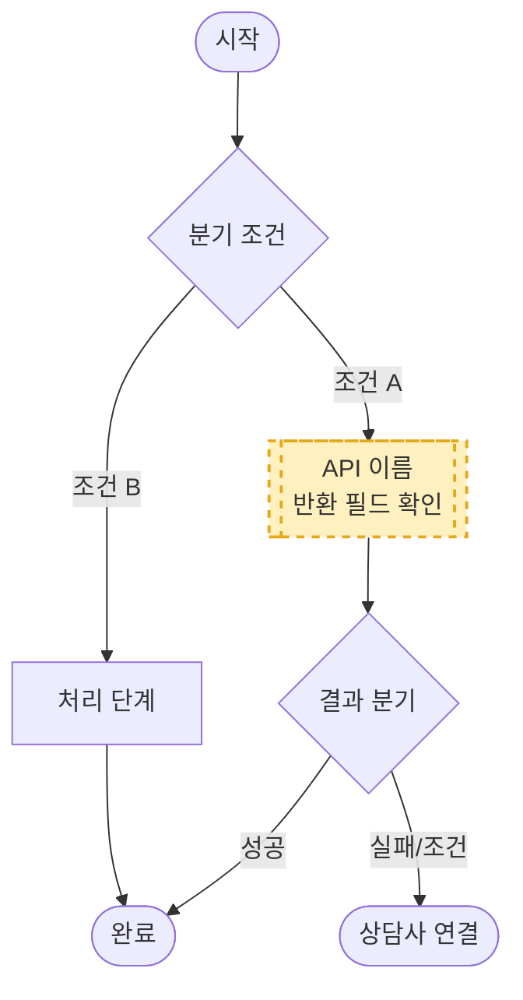

---

**태스크 {영문자} — {이름}**

| 항목 | 내용 |
|------|------|
| 커버 범위 | {처리하는 상담 유형 설명} |
| 진단 순서 | {분기 조건 순서} |
| API 호출 | `{API 이름}` — {호출 조건} / 없음 |
| ALF 종결 | {자동 완결 케이스 목록} |
| 상담사 연결 | {연결 필요 조건} |
| 상담사 전달 정보 | {전달 정보 목록} |
